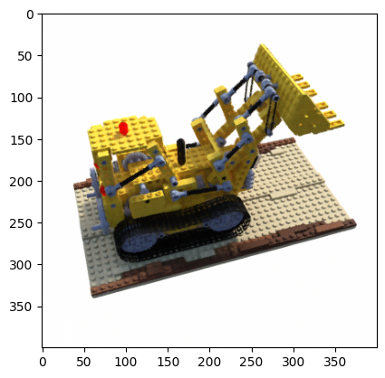
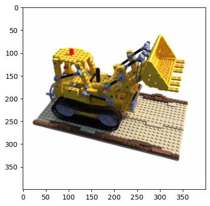

# NeRF simplified

### Recommend to read: A detailed NeRF extension list: [awesome-NeRF](https://github.com/yenchenlin/awesome-NeRF)

## Usage

**Dataset:** [Download the training and testing datasets](https://drive.google.com/drive/folders/18bwm-RiHETRCS5yD9G00seFIcrJHIvD-?usp=sharing).
```commandline
$ pip3 install -r requirements.txt
$ python3 nerf.py
```

## Results


#### Novel views rendered from the optimized NeRF representation


               |   
:-------------------------:|:-------------------------:
  |  


## Credits

- The datasets were generated with the code from [kwea123/nerf_pl](https://github.com/kwea123/nerf_pl/blob/master/datasets/blender.py).
- The training hyperparameters were retrieved from [kwea123/nerf_pl](https://github.com/kwea123/nerf_pl).

## What is not implemented

- Hierarchical volume sampling
